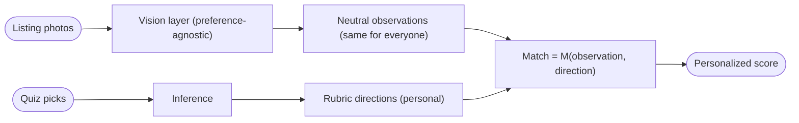
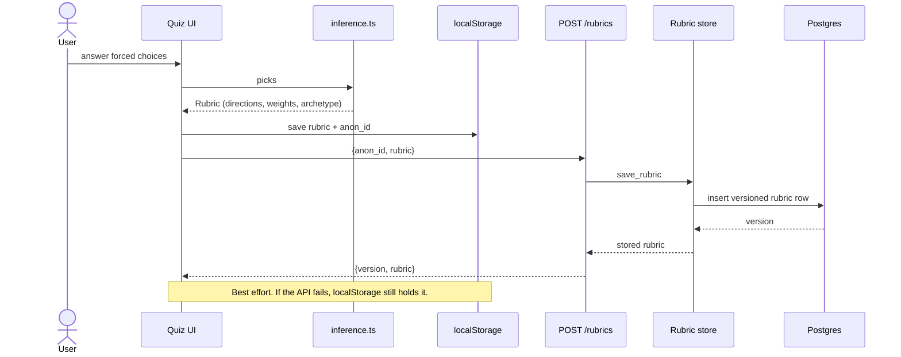
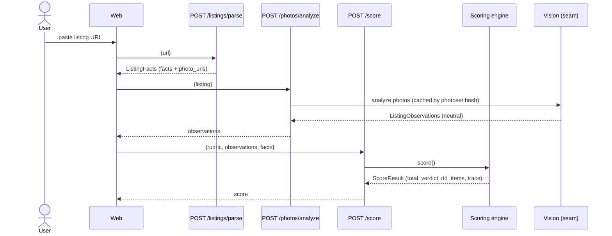
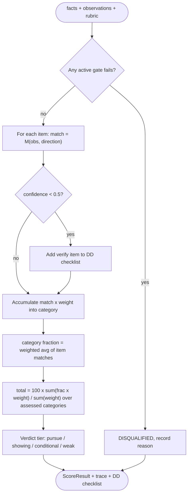
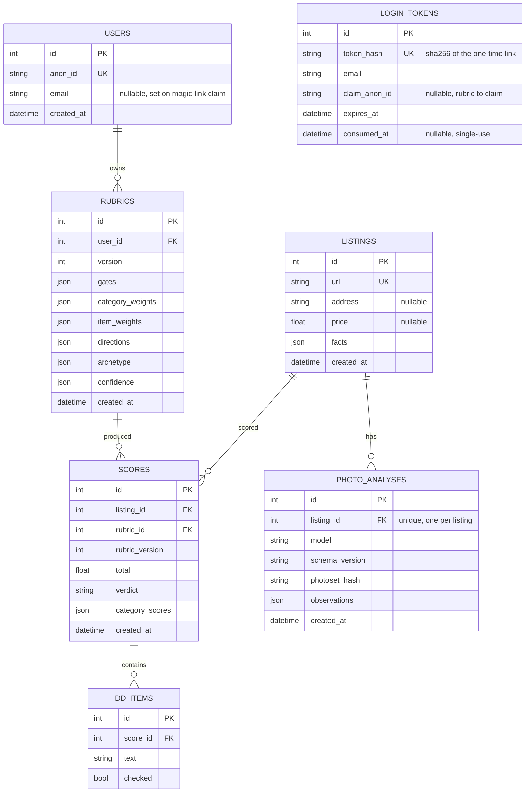
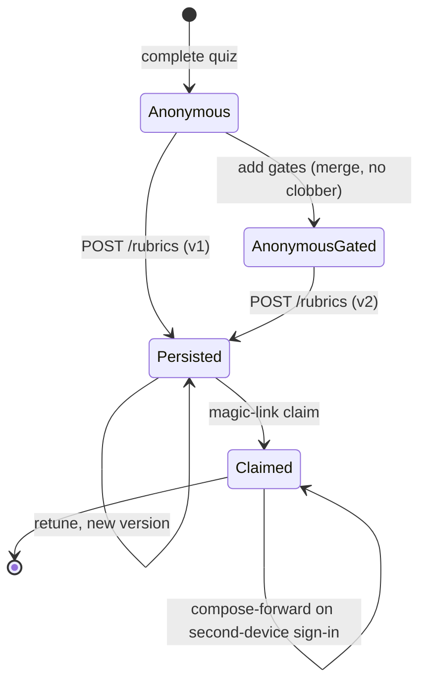

# Architecture

This document tracks the data flow, layers, and modules as they are actually built.
It is updated whenever the data flow, layers, modules, or schema change.
Diagrams are written in Mermaid and render on GitHub.

## One paragraph

A user answers image-only forced-choice questions in the web app.
The quiz infers a personal taste rubric (directional preferences plus category and item weights) entirely on the client.
They optionally complete a gates step (budget, district, beds and baths) that adds hard constraints to the rubric.
They paste listing URLs.
The scoring service fetches the page, extracts facts and photo URLs, analyzes the photos into preference-neutral observations, and applies the rubric via deterministic match times weight math to produce a 0 to 100 score, a verdict, and a due-diligence checklist.
The same listing scores differently for different users, which is the product.

## System context

Dashed edges are planned, not yet built.

## The neutrality invariant

Personalization enters through exactly one door: the rubric.
The vision layer is preference-agnostic and produces the same observations for everyone.

## Layers

### Web (`apps/web`)

React plus TypeScript plus Vite plus Tailwind.
The quiz module (`src/quiz/`) is the current surface.
`questions.ts` is the data-driven question bank.
`inference.ts` is a pure function from picks to a `Rubric`, inferring all five taste axes (tone, era, walls, ornament, naturalness) from pick consistency.
`storage.ts` persists the anonymous rubric in the browser.
`Quiz.tsx` and `Reveal.tsx` render the forced-choice flow and the dual reveal.
`scene/` is the parametric illustration engine: `tokens.ts` holds the matched warm and cool palettes, `Scene.tsx` draws each base room once and themes it by a tone palette swap and an era motif swap, so a pair's two options are the same geometry and neutrality is structural rather than curated.
`OptionImage.tsx` is the single swap seam: it renders an option's curated photo when one is set and the parametric scene otherwise.
`shareCard.ts` exports the reveal as an Open-Graph-sized image card, via the Web Share API where available and a PNG download otherwise.
`compare/Compare.tsx` ranks a user's scored listings.
`account/Account.tsx` is the sign-in bar: it requests a magic link, and `App.tsx` verifies a `?token=` landing, stores the signed session, and strips the token from the URL.
`gates/` holds the gates form and its pure parse and validation.
`rubric/merge.ts` composes the quiz rubric with gates without clobbering either side.
`api/client.ts` posts the rubric to the scoring service, best effort.

### Contracts (`packages/contracts`)

The single source of truth for the shapes exchanged across the system.
`Rubric` is produced by the quiz and consumed by the scorer.
`ListingFacts`, `ListingObservations`, and `ScoreResult` are the scoring-service boundary types.
The Python service mirrors these as Pydantic models in `services/scoring/app/schemas.py`.

### Scoring service (`services/scoring`)

Python plus FastAPI.
The API layer is split into routers under `app/api/routes/` (listings, photos, score, scores, rubrics).
The pure scoring engine lives in `app/scoring/engine.py` and performs no I/O.
Tunable match tables and thresholds live in `app/scoring/scoring_config.json`, loaded by `app/scoring/config.py`, so tuning does not require a code change.
Persistence lives in `app/db/` (models, engine, session), `app/rubrics/` (rubric store and the server-side merge mirror), and `app/scores/` (the score-run store), all kept out of the pure engine.

## Quiz and persistence flow

## Scoring data flow

`POST /listings/parse` takes a pasted public URL.
`app/api/routes/listings.py` fetches the page through an injectable `fetch_html`, then `app/listings/parser.py` extracts facts and photo URLs.
Because the URL is user-supplied, every server-side fetch (listing pages and photos) goes through `app/net/guard.py`, which resolves the host and refuses any address that is loopback, link-local, private, reserved, or multicast, follows redirects manually so each hop is re-validated, and bounds the redirect count.
This closes the SSRF vector where a pasted URL or a redirect points at cloud metadata or an internal host; a residual DNS-rebinding window between validation and connection is the known limitation, mitigated later by pinning the resolved address.
Extraction prefers schema.org JSON-LD, then Open Graph and meta tags, then a regex pass over visible text.

`POST /photos/analyze` takes the parsed facts.
`app/photos/analyzer.py` returns preference-neutral observations and caches them by a photoset hash so re-scoring is free.
The analyzer is a pluggable seam resolved at request time: `app/photos/vision.py` `ClaudeVisionAnalyzer` calls Claude vision with the [scoring-contract.md](scoring-contract.md) prompt and parses the JSON into the observation schema, gated on `ANTHROPIC_API_KEY`.
The pass is two-tier (contract section 8): `app/photos/images.py` resizes every photo to a ~1300px long edge (falling back to the raw URL if an image cannot be fetched or decoded), a cheap triage model classifies room types and drops near-duplicate rooms when there are more photos than the cap, and the strong model then runs the full observation pass on the deduplicated set.
Without a key the service falls back to a stub that flags `vision_unconfigured`, so the deterministic pipeline still runs.
The routes stay synchronous so FastAPI runs the blocking fetch and vision calls in a threadpool rather than on the event loop.

`POST /score` takes the rubric, the observations, and the facts.
`app/scoring/engine.py` checks gates, computes a per-item match parameterized only by the rubric direction, aggregates each category as a weighted-average match, and normalizes across the assessed categories to a 0 to 100 total.

## Scoring engine

For each scored item, match is a 0 to 1 measure of how ideal the observation is for this user, driven only by the rubric direction.
A category fraction is the item-weight-weighted average of its item matches.
Two rubrics with different directions or different category weights therefore produce different totals for the same observations.
Confidence follows a single 0.5 threshold: a low-confidence finding is scored at its observed value and added to the due-diligence checklist, with no silent value adjustment.
The value category is an MVP stub computed from budget headroom, with a seam for the reno estimator.
The age category is scored from `year_built` through configurable bands (a maintenance-risk proxy) and is excluded from the total only when `year_built` is unknown, so it never silently caps a score; older homes add a systems due-diligence prompt.
Architectural and interior style are scored by style affinity: each style is a fixed point in a five-axis taste space, the buyer is a point derived from their rubric directions, and the match is their axis agreement (see [scoring-contract.md](scoring-contract.md) sections 4 and 6.3).
Style coordinates live in `scoring_config.json`, so the vocabulary grows without code change.

## Persistence

Rubrics persist server-side with no login friction (anonymous-first).
The quiz generates an anonymous id in the browser, and the web app posts the rubric to `POST /rubrics` keyed by that id.
The scoring service stores it in Postgres (SQLite in tests) as a `users` row and a versioned `rubrics` row.
Each save writes a new version, so tuning weights never rewrites a past rubric (`GET /rubrics/{anon_id}` returns the latest, `GET /rubrics/{anon_id}/versions` lists all).

The SQLAlchemy models live in `app/db/models.py`, the engine and session in `app/db/base.py`, and the store functions in `app/rubrics/store.py` (rubrics) and `app/scores/store.py` (score runs).
Persistence is kept out of the pure scoring engine, which still performs no I/O.
`merge_gates` (in `app/rubrics/merge.py`, mirroring the web client) adds stated gates without overwriting the quiz-derived rubric parts.
The anonymous-to-account compose-forward merge is deferred with Phase E rather than kept as unused code.

Score runs persist through `POST /scores/run`, which gets-or-creates the `listings` row for a URL, reuses the cached `photo_analyses` row when one exists (keyed by photoset hash), scores against the caller's latest rubric, and inserts a new `scores` row with its `rubric_version` plus any due-diligence items.
`GET /scores/{anon_id}` returns the caller's scored listings ranked by total, keeping only the newest score per listing.
Listings and photo analyses are shared across users because they are preference-neutral; only scores are per-rubric.
A new score is always inserted rather than an old one updated, so tuning a rubric never rewrites a past score.

### Data model

All entities below are built.

### Rubric lifecycle

Sign-in is passwordless (Phase E, `app/auth/`).
`POST /auth/request` mints a one-time login token, stores only its hash in `login_tokens`, and emails the link through a pluggable sender (a real provider when `RESEND_API_KEY` is set, otherwise a console sender that returns the link as `dev_link` for local use).
`POST /auth/verify` consumes the token and claims the account: with no prior account it sets `email` on the same anonymous `users` row, so the rubric is claimed with no migration; when the email already has an account it composes the device's latest rubric forward onto that account as a new version (`compose_forward`, keeping the fresh quiz taste and the account's gates).
It returns a stateless signed session token (HMAC over the user id and the user's session epoch), which `GET /auth/me` verifies from a `Bearer` header.
`POST /auth/signout` bumps the user's `session_epoch`, so every outstanding token (issued under the old epoch) is revoked server-side at once, not just dropped client-side.
The `infra/docker-compose.yml` provisions Postgres, and the service auto-creates tables on startup for MVP (a migration tool replaces this when the schema stabilizes).
