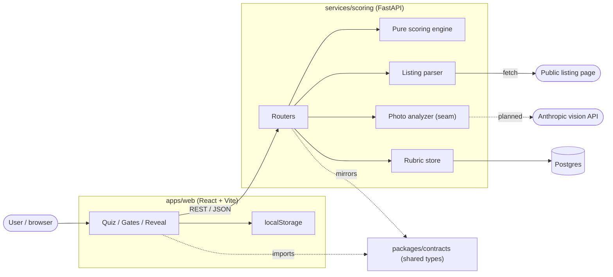
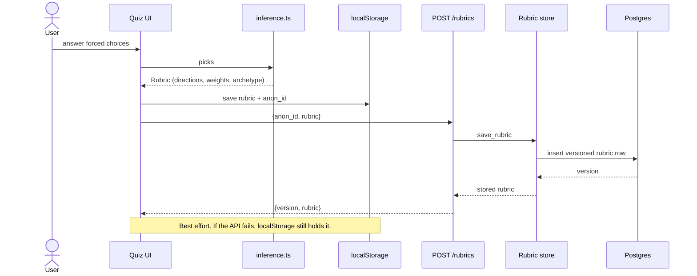
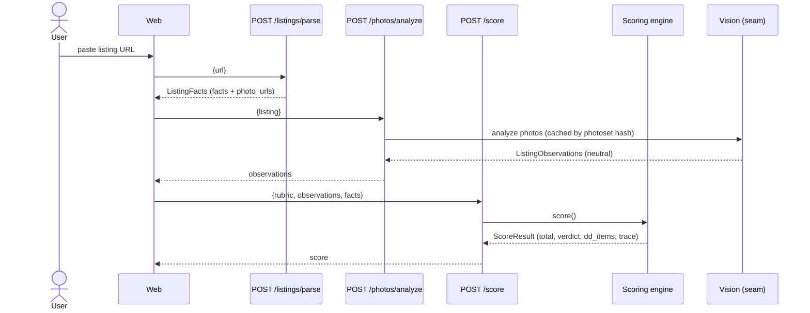
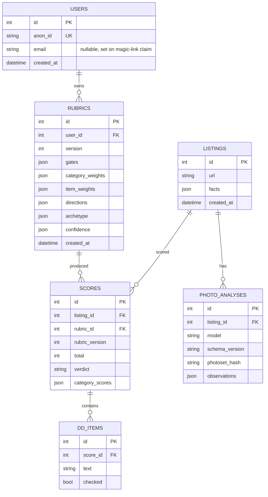
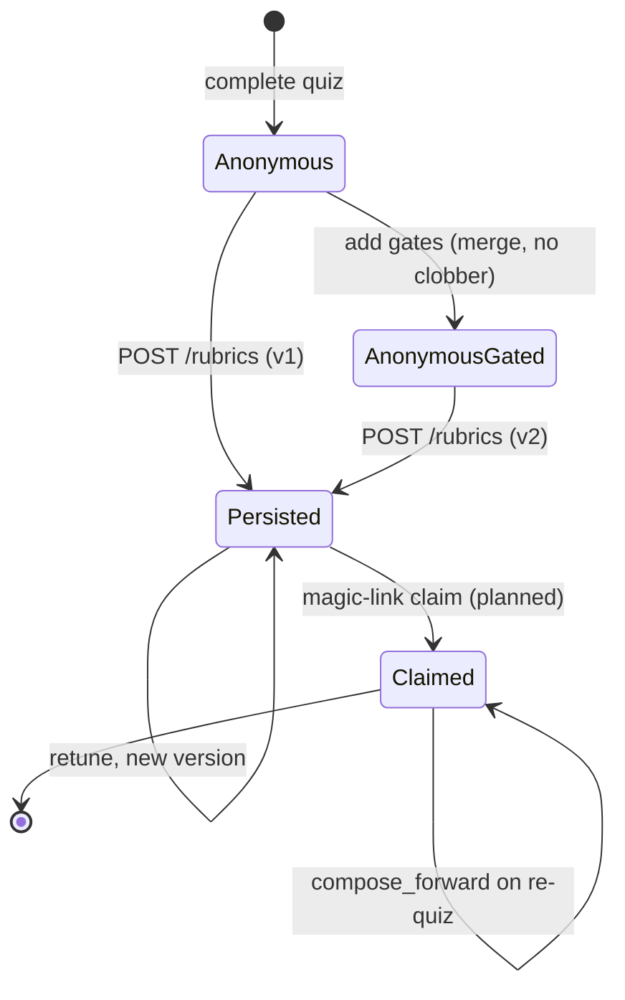

# Architecture

This document tracks the data flow, layers, and modules as they are actually built.
It is updated whenever the data flow, layers, modules, or schema change.
Diagrams are written in Mermaid and render on GitHub.

## One paragraph

A user answers image-only forced-choice questions in the web app.
The quiz infers a personal taste rubric (directional preferences plus category and item weights) entirely on the client.
They optionally complete a gates step (budget, district, beds and baths) that adds hard constraints to the rubric.
They paste listing URLs.
The scoring service fetches the page, extracts facts and photo URLs, analyzes the photos into preference-neutral observations, and applies the rubric via deterministic match times weight math to produce a 0 to 100 score, a verdict, and a due-diligence checklist.
The same listing scores differently for different users, which is the product.

## System context

Dashed edges are planned, not yet built.

## The neutrality invariant

Personalization enters through exactly one door: the rubric.
The vision layer is preference-agnostic and produces the same observations for everyone.

## Layers

### Web (`apps/web`)

React plus TypeScript plus Vite plus Tailwind.
The quiz module (`src/quiz/`) is the current surface.
`questions.ts` is the data-driven question bank.
`inference.ts` is a pure function from picks to a `Rubric`.
`storage.ts` persists the anonymous rubric in the browser.
`Quiz.tsx` and `Reveal.tsx` render the forced-choice flow and the dual reveal.
`gates/` holds the gates form and its pure parse and validation.
`rubric/merge.ts` composes the quiz rubric with gates without clobbering either side.
`api/client.ts` posts the rubric to the scoring service, best effort.

### Contracts (`packages/contracts`)

The single source of truth for the shapes exchanged across the system.
`Rubric` is produced by the quiz and consumed by the scorer.
`ListingFacts`, `ListingObservations`, and `ScoreResult` are the scoring-service boundary types.
The Python service mirrors these as Pydantic models in `services/scoring/app/schemas.py`.

### Scoring service (`services/scoring`)

Python plus FastAPI.
The API layer is split into routers under `app/api/routes/` (listings, photos, score, rubrics).
The pure scoring engine lives in `app/scoring/engine.py` and performs no I/O.
Tunable match tables and thresholds live in `app/scoring/scoring_config.json`, loaded by `app/scoring/config.py`, so tuning does not require a code change.
Persistence lives in `app/db/` (models, engine, session) and `app/rubrics/` (store and the server-side merge mirror), kept out of the pure engine.

## Quiz and persistence flow

## Scoring data flow

`POST /listings/parse` takes a pasted public URL.
`app/api/routes/listings.py` fetches the page through an injectable `fetch_html`, then `app/listings/parser.py` extracts facts and photo URLs.
Extraction prefers schema.org JSON-LD, then Open Graph and meta tags, then a regex pass over visible text.

`POST /photos/analyze` takes the parsed facts.
`app/photos/analyzer.py` returns preference-neutral observations and caches them by a photoset hash so re-scoring is free.
The real Claude vision analyzer is a pluggable seam.
It is currently a stub that flags `vision_unconfigured`; the real analyzer will be built against the vision prompt and observation schema in [scoring-contract.md](scoring-contract.md).

`POST /score` takes the rubric, the observations, and the facts.
`app/scoring/engine.py` checks gates, computes a per-item match parameterized only by the rubric direction, aggregates each category as a weighted-average match, and normalizes across the assessed categories to a 0 to 100 total.

## Scoring engine

For each scored item, match is a 0 to 1 measure of how ideal the observation is for this user, driven only by the rubric direction.
A category fraction is the item-weight-weighted average of its item matches.
Two rubrics with different directions or different category weights therefore produce different totals for the same observations.
Confidence follows a single 0.5 threshold: a low-confidence finding is scored at its observed value and added to the due-diligence checklist, with no silent value adjustment.
The value category is an MVP stub computed from budget headroom, with a seam for the reno estimator.
The age category is deferred and excluded from the total rather than counted as zero.
Architectural and interior style are scored by style affinity: each style is a fixed point in a five-axis taste space, the buyer is a point derived from their rubric directions, and the match is their axis agreement (see [scoring-contract.md](scoring-contract.md) sections 4 and 6.3).
Style coordinates live in `scoring_config.json`, so the vocabulary grows without code change.

## Persistence

Rubrics persist server-side with no login friction (anonymous-first).
The quiz generates an anonymous id in the browser, and the web app posts the rubric to `POST /rubrics` keyed by that id.
The scoring service stores it in Postgres (SQLite in tests) as a `users` row and a versioned `rubrics` row.
Each save writes a new version, so tuning weights never rewrites a past rubric (`GET /rubrics/{anon_id}` returns the latest, `GET /rubrics/{anon_id}/versions` lists all).

The SQLAlchemy models live in `app/db/models.py`, the engine and session in `app/db/base.py`, and the store functions in `app/rubrics/store.py`.
Persistence is kept out of the pure scoring engine, which still performs no I/O.
Server-side merge logic mirrors the web client in `app/rubrics/merge.py` (compose, do not clobber) for the future account-claim flow.

### Data model

Solid entities are built today.
Dashed entities (listings, photo analyses, scores, due-diligence items) are the Phase D schema, shown here as the target.

### Rubric lifecycle

Real login is deferred by design.
An optional magic-link claim will later set `email` on the same `users` row, so an anonymous rubric is claimed without any migration.
The `users.email` column is already nullable and unique for that path.
The `infra/docker-compose.yml` provisions Postgres, and the service auto-creates tables on startup for MVP (a migration tool replaces this when the schema stabilizes).
