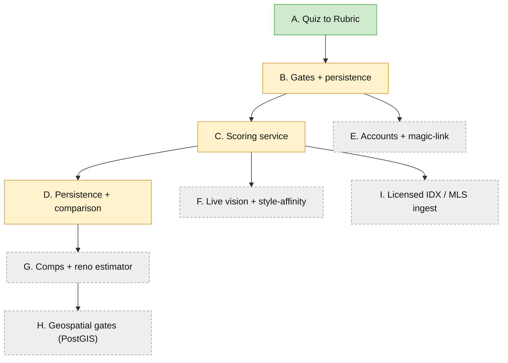

# Roadmap

This document captures the work beyond the four MVP phases, including steps that do not yet have a detailed plan.
The four MVP phases (A to D) are specified in [docs/plans/](plans/README.md).
This roadmap places them in context and enumerates the future phases and cross-cutting work that follow.

## Status snapshot

| Phase | Title | Status |
|---|---|---|
| A | Quiz to Rubric | Core + share card + parametric illustration bank built |
| B | Gates + anonymous persistence + merge | Built; magic-link claim deferred |
| C | Scoring service | Deterministic core built; live vision to build |
| D | Persistence + comparison | Built; keyed by anonymous id |
| E | Accounts + magic-link claim | Not planned in detail |
| F | Live vision + style-affinity | Not planned in detail |
| G | Comps + reno estimator (full value) | Not planned in detail |
| H | Geospatial gates (PostGIS) | Not planned in detail |
| I | Licensed IDX / MLS ingestion | Not planned in detail |

## Phase map

## Finishing the current phases

### Phase A remainder: image bank (built as a parametric illustration system)

The reveal's image share-card export is built (`apps/web/src/quiz/shareCard.ts`): "Share my flavor" renders an Open-Graph-sized card of the archetype and its blend, using the Web Share API where available and falling back to a PNG download.

The image bank took the illustration route from [illustration-bank.md](plans/illustration-bank.md) rather than licensed photography.
It is a token-driven parametric SVG engine (`apps/web/src/quiz/scene/`): six base rooms (living, kitchen, bedroom, facade, backyard, walls), each drawn once as fixed geometry and themed by tokens.
Tone is a palette swap and era is a motif swap, so within any pair the two options are the same drawing and neither can be better-lit, better-composed, or more lovingly rendered than the other.
This makes the neutrality that photos would force you to police (see [preference-neutrality.md](plans/preference-neutrality.md)) structural instead: warm and cool palettes are matched in lightness and contrast, only the accent pop is saturation-matched, and both poles carry equal staging.
The per-option `photo` override seam is retained, so a curated photo can still replace any scene later with a one-field change.
What remains is validation rather than construction: the bias smoke test on real users and the vision pre-screen QA of each scene.

### Phase C remainder: live vision

The deterministic core, the full style model, and the Claude vision analyzer are all built.
`app/photos/vision.py` calls Claude vision with the section 7 prompt and parses the JSON into the observation schema, gated on `ANTHROPIC_API_KEY` with a stub fallback.
What remains is production hardening rather than new capability: the cheap triage-model dedup pass and image resizing (section 8), a live cost and latency check on the two-tier split, and switching the analyzer call to async so the vision request does not block the event loop.
Dependency: an Anthropic API key to exercise the live path.
Size: small.

### Phase D: persistence and comparison

Built, per [phase-d-persistence-comparison.md](plans/phase-d-persistence-comparison.md).
The `listings`, `photo_analyses`, `scores`, and `dd_items` tables land, a score run persists the listing facts, the photo analysis (reusing the Phase C photoset-hash cache), the score with its rubric version, and the due-diligence items, and the web app ranks a user's scored listings in a comparison view.
Listing facts and photo analyses are shared across users because they are preference-neutral; only scores are per-rubric, which keeps the neutrality invariant.
Scoring is keyed by anonymous id, so it works before any account exists; the magic-link account claim stays deferred to Phase E.
Dependency: Phase C `ScoreResult`, Phase B persistence.

## Future phases (not yet planned in detail)

### Phase E: accounts and the magic-link claim

Give a buyer a real account so their rubric follows them across devices.
Passwordless magic-link: the service emails a signed one-time link, verifies it, and sets `email` on the existing anonymous `users` row, claiming the anonymous rubric with no migration.
The account-claim merge composes the anonymous quiz rubric forward into the account rubric without clobbering either side (build this with Phase E rather than carrying it as unused code now).
Dependency: an email sender (for example Resend or SES); the schema and merge logic already exist.
Open questions: session strategy (signed cookie versus token), link expiry and rate limiting, multi-device anonymous-id reconciliation.
Size: medium.

### Phase F: live vision and style-affinity

Folded into the Phase C remainder above; called out separately here because it is the single largest driver of scoring quality and can be sequenced independently of Phase D.

### Phase G: comps and the reno estimator (full value category)

Replace the value stub with a real model: parse comparable sales when available, and plug in the reno estimator to supply an all-in cost, so the value category reflects true economics rather than budget headroom alone.
Dependency: a comps data source; the reno estimator (tabled companion `reno-estimator.md`).
Open questions: comps availability and licensing, estimator scope.
Size: large.

### Phase H: geospatial gates

Automate the district and main-road gates the MVP leaves stated.
Add PostGIS, ingest district and road-class geometries, and enforce the location gates from coordinates rather than user assertion.
Dependency: PostGIS extension (already anticipated), geospatial data sources.
Size: large.

### Phase I: licensed IDX / MLS ingestion

Replace manual URL paste with a licensed IDX or MLS feed, the eventual data path the business context calls for.
This removes the scraping and terms-of-service constraints of the MVP and unlocks aggregate-data products.
Dependency: a licensing agreement; a normalization layer from feed schema to `ListingFacts`.
Size: large, plus legal and commercial work.

## Cross-cutting engineering backlog

These are not phases; they are ongoing concerns that should land as the product hardens.

- Migrations: replace startup `create_all` with a migration tool (for example Alembic) once the schema stabilizes, so production schema changes are reviewable and reversible.
- Contracts synchronization: generate JSON Schema from `packages/contracts` and add a test that the Pydantic models stay in sync, closing the hand-mirroring drift risk noted in the architecture.
- CI and CD: run the Python and web suites and the bias smoke test on every change; add a build and deploy pipeline.
- Deployment and hosting: define where the web app, the scoring service, and Postgres run; document environments and secrets handling.
- Observability: structured logging, error tracking, and request tracing across the two services.
- Cost and abuse controls: rate limit `/listings/parse` and `/photos/analyze`, since both cost money (fetch bandwidth and vision tokens); cache aggressively; guard against scraping of the parse endpoint.
- Privacy and consent: capture the anonymous preference profile with clear consent from day one, and define retention and deletion, since the profile is a compounding data asset that must stay unencumbered.
- Security review: authentication hardening for Phase E, input validation at every boundary, and a dependency audit.
- Performance and load: measure the vision path latency and the parse path resilience; add load testing before any launch.
- Accessibility: audit the quiz and reveal for keyboard and screen-reader use; the forced-choice UI already supports keyboard, but the reveal and gates form need a full pass.
- Progressive web app: offline-friendly quiz and installability, since the MVP is responsive web.

## Product and business backlog

- Monetization: subscription on scoring, agent referral, or acquisition; the architecture keeps the option open and does not depend on any one path.
- Analytics: funnel instrumentation from quiz start to account claim to first score, to see where buyers convert.
- Share and virality: the archetype share card is the shareable payload; measure and optimize it.

## Data and model backlog

- Production bias monitoring: run the aggregate-archetype uniformity check on real anonymized sessions, not just synthetic ones, so bias that creeps into words, images, or math is caught in production.
- Rubric quality tuning: use scored outcomes and any explicit feedback to tune category and item weight bounds and the style coordinates, all of which live in config.
- Feedback loop: let buyers correct a score or a style read, and feed that into tuning without ever letting it leak taste into the neutral vision layer.
